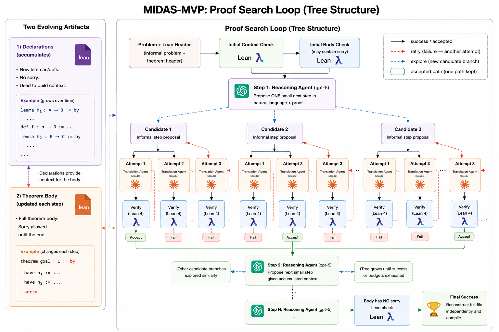

# Midas MVP

A **lemma-oriented, bounded, linear proof-search loop** for Lean 4. Given an informal problem and a
Lean theorem header, it drives two LLMs — a **reasoner** (GPT-5, proposes one small English step) and
a **translator** (Claude, renders it to Lean) — through a **verify → accept-or-retry** loop until an
explicit final action compiles without `sorry`, or a budget is exhausted. Every proposed declaration
and theorem-body update is checked by Lean in accumulated context.

Midas supports two problem modes:

- **Easy Mode** completes one unfinished theorem.
- **Hard Mode** keeps one unresolved definition immutable during exploration, then fills that
  definition and completes the theorem in one atomic final transaction.

The reasoner searches only in English. It never receives Lean source or compiler diagnostics. If
every Lean translation of an English candidate fails, its exact `NEXT STEP` is shown to the
reasoner so the next candidate can simplify or reformulate it.

> **Training / modifying it:** the intended way to improve behavior is to improve the two prompt files
> in `considerations/` from observed run failures — the metaoptimizing loop. **Read the diagram below`** for
> that workflow; this README is how to *run and extend* the system.

---





---

## Setup & running (Ubuntu environment - setup WSL if you're on Windows)

**1. Add your OpenRouter API key**
You will need to create your own key and buy credits on OpenRouter ($10 should be enough), or alternatively reach out to Daniel to share his API key.
It should never be committed to the repo. 
Only `run` needs it.

  ```bash
  echo "export OPENROUTER_API_KEY='sk-or-...'" > ~/.midas-mvp.env && chmod 600 ~/.midas-mvp.env
  ```

**2. Install Lean 4 (via elan - the Lean toolchain manager):**
  ```bash
  curl https://raw.githubusercontent.com/leanprover/elan/master/elan-init.sh -sSf | sh
  ```
  Choose option 1) Proceed with installation (default)
  After installation, restart your shell or run:

  ```bash
  source "$HOME/.elan/env"
  ```
  Verify that `elan` is available:

  ```bash
  elan --version
  ```

**3. Install a prebuilt Mathlib for v4.31.0:**
  ```bash
  # Alternatively to these two commands, you can reuse any mathlib project if you have it
  cd /desired/mathlib_project/location # simple option: cd ~
  lake +leanprover/lean4:v4.31.0 new mathlib_host math # shouldn't take more than 2 minutes

  cd mathlib_host
  # make sure that lean-toolchain contains "leanprover/lean4:v4.31.0"
  # make sure that lakefile.toml has a "[[require]]" section with name = "mathlib" and rev = "v4.31.0"
  lake exe cache get        # downloads prebuilt Mathlib oleans (minutes, not hours)
  lake build

  ```

**4. Clone, and install the toolchain on first `lean` call.**
```bash
# Assuming that you're still on the mathlib_host folder
cd ..
git clone https://github.com/soilmilk/midas-mvp.git
cd midas-mvp                    # <-- run everything below from here
lean --version                  # Should print something that starts with "Lean (version 4.31.0."
```

**5. Build the warm verifier and connect it to Mathlib.**
Future problems are expected to use `import Mathlib`, so the warm backend is part of normal setup.
The warm executable is built from this repo; Mathlib oleans stay in your local `mathlib_host`.
```bash
cd warm-server
lake build warm
cd ..

# Save the Mathlib LEAN_PATH where midas-mvp's warm backend will read it automatically.
(cd path/to/mathlib_host && lake env printenv LEAN_PATH) > warm-server/mathlib_leanpath.txt
# ex: (cd ~/mathlib_host && lake env printenv LEAN_PATH) > warm-server/mathlib_leanpath.txt
```

**6. Install Python deps** (Python 3.9+). `openai` handles *all* calls — both models route through
OpenRouter's OpenAI-compatible API.
```bash
# Assuming that you're still on the midas-mvp folder
sudo apt update
python3 -m venv .venv  # if it's a new EC2, it might tell you to run something before
source .venv/bin/activate
pip install pydantic openai
```


**7. Testing the install (works even if you don't have a key)**

```bash
python3 tests/run_all.py
```

The runner executes every deterministic gate sequentially and makes no model API calls. The
fresh/warm parity gate runs when the local warm executable and Mathlib `LEAN_PATH` are available;
otherwise that environment-dependent gate reports an explicit `SKIP`.

**8. Run a real Lean 4 problem** (needs your OpenRouter key).
Every time you reopen the workspace, run the following commands:
```bash
cd path/to/midas-mvp/
source .venv/bin/activate
source ~/.midas-mvp.env
source "$HOME/.elan/env"
(cd path/to/mathlib_host && lake env printenv LEAN_PATH) > warm-server/mathlib_leanpath.txt
# ex: (cd ~/mathlib_host && lake env printenv LEAN_PATH) > warm-server/mathlib_leanpath.txt
```

Then you can run the following:
```
# The first real run.
# As the proof progresses, take a look at runs/p4_n5_30/artifacts/proof_steps.
# You will see the loop happening in real time!
# Due to loading mathlib, it could take several minutes.
python3 -m midas.cli run p4_n5_30

# Alternatively, you can run this command from another terminal:
python3 -m midas.cli status p4_n5_30
```


---

## Adding a problem of your own (requires knowing what Easy Mode and Hard Mode are)
A quick example: if we were to solve IMO 2026 P4, here's the difference:

Hard Mode (original): "For which real values of $\theta$ can Mulan guarantee her victory in finitely many steps, no matter how Shan-Yu plays?"

Easy Mode: "Prove that the θ's for which Mulan guarantee her victory in finitely many steps are: 180◦/n, for some integer n ≥ 2."

Hard Mode requires conjecturing and proving the answer.
Easy Mode already has the answer and requires proving that it's correct.

Every problem explicitly or implicitly selects a mode in `config.json`:

```json
{
  "problem_mode": "easy"
}
```

`problem_mode` is `"easy"` or `"hard"` and defaults to `"easy"` for old configurations.

Easy Mode layout:

```text
problems/<id>/
  config.json
  input/
    informal_problem.md
    context.lean
    body_initial.lean
  reference_solution.lean   # optional; the loop never reads it
```

Hard Mode adds one file:

```text
problems/<id>/
  config.json               # contains "problem_mode": "hard"
  input/
    informal_problem.md
    context.lean
    placeholder.lean
    body_initial.lean
  reference_solution.lean   # optional
```

Rules that matter:

- `context.lean` contains the definitions the theorem needs and no imports; put imports in
  `lean_prelude`.
- `body_initial.lean` contains exactly one theorem with either a `:= sorry` expression hole
  or a tactic body beginning with `:= by`. Its immutable header prefix is stored and enforced
  byte-for-byte on every later body.
- Hard Mode requires `placeholder.lean`; Easy Mode rejects it.
- The supported placeholder is exactly one top-level `def` or `abbrev`, optionally prefixed
  by `noncomputable`. Both expression-style and tactic-style holes are accepted:

  ```lean4
  noncomputable abbrev answerSet : Set ℕ := sorry

  noncomputable def answer : ℝ := by
    sorry
  ```

  Its immutable signature prefix (through `:=`, or through `:= by` for tactic style) is
  preserved byte-for-byte. Imports, namespaces, auxiliary or already-completed declarations,
  and declaration kinds other than `def` and `abbrev` are rejected. A standalone
  `noncomputable` command is still forbidden in this file.

Example `config.json`:

```json
{
  "problem_mode": "hard",
  "max_proof_steps": 8,
  "max_informal_candidates_per_proof_step": 3,
  "max_lean_translation_attempts_per_candidate": 3,
  "max_total_lean_attempts": 60,
  "max_runtime_seconds": 900,
  "lean_prelude": [
    "import Mathlib",
    "import Aesop",
    "set_option maxHeartbeats 0",
    "open BigOperators Real Nat Topology Rat"
  ],
  "reasoning_model": "openai/gpt-5",
  "translation_model": "anthropic/claude-sonnet-5",
  "reviewer_model": "openai/gpt-5",
  "reasoning_effort": "low",
  "translator_reasoning_effort": "low",
  "reviewer_reasoning_effort": "low",
  "max_reviewer_call_attempts": 2,
  "verifier_backend": "warm"
}
```

Semantic review is mandatory after every compiling translator transaction. If `reviewer_model`
or `reviewer_reasoning_effort` is omitted, it inherits the translator setting. A reviewer outage
or malformed response is retried up to `max_reviewer_call_attempts`, then fails closed.

- `lean_prelude` contains full Lean lines, prepended verbatim.
- `reasoning_effort` is `minimal | low | medium | high`. It is the largest latency lever;
  `minimal` is fastest but may use no reasoning tokens. See `NOTES.md`.
- `translator_reasoning_effort` independently controls translator thinking. If omitted, the
  model/provider default applies. OpenRouter accepts `none | minimal | low | medium | high |
  xhigh | max`, subject to the selected model's supported levels.

### Hard Mode protocol and transaction

Every new reasoner action includes non-empty `NEXT STEP`, `PROOF`, and `IDEAS FOR THE FUTURE`
fields plus an exact `IS_FINAL_STEP: True` or `IS_FINAL_STEP: False`. Future ideas form a rolling,
unproved roadmap; only the roadmap from an accepted step is passed to the next reasoner call.
Previously accepted steps are shown chronologically and remain formally verified, while later
reasoners may reassess which facts are relevant as the roadmap changes.

- Easy Mode never uses an `ANSWER` field.
- A non-final Hard Mode action forbids `ANSWER`.
- A final Hard Mode action requires one non-empty English/mathematical `ANSWER`; it is not Lean
  source and is not persisted as an accepted answer branch.

A non-final action, and any Easy Mode action, uses:

```text
INTERMEDIATE REASONING:
...

NEXT STEP:
...

PROOF:
...

IS_FINAL_STEP: True | False

IDEAS FOR THE FUTURE:
<non-empty roadmap; this is always the final section>
```

A final Hard action instead ends with:

```text
IS_FINAL_STEP: True

ANSWER:
<concrete answer in English or mathematical notation>

IDEAS FOR THE FUTURE:
None — the theorem is complete
```

Exploration translations contain `NEW DECLARATIONS` and a complete `UPDATED THEOREM BODY`.
Easy final translations contain `NEW DECLARATIONS` and a complete `FINAL THEOREM BODY`. Hard final
translations contain `NEW DECLARATIONS`, `FILLED PLACEHOLDER`, and `FINAL THEOREM BODY`, in that
order. An exploration translation cannot fill the placeholder.

Entries in `NEW DECLARATIONS` may use `noncomputable` as a declaration modifier, for example
`noncomputable def angleMod ...`. A standalone command such as `noncomputable section` remains
forbidden, as does `noncomputable` in the theorem-body region.

The selected translator schema is exact:

```text
Exploration:       NEW DECLARATIONS → UPDATED THEOREM BODY
Easy final:        NEW DECLARATIONS → FINAL THEOREM BODY
Hard final:        NEW DECLARATIONS → FILLED PLACEHOLDER → FINAL THEOREM BODY
```

Instead of a Lean transaction, the translator may reject an unsuitable informal candidate:

```text
INTERMEDIATE REASONING:
<check the exact claim against the hypotheses and formal context>

TRANSLATION REJECTED:
KIND: MATHEMATICALLY_INCORRECT
REASON:
<English explanation identifying the precise defect>
```

The other accepted kinds are `MISSING_ASSUMPTION` and `INCOMPATIBLE_WITH_CONTEXT`.
`HARD_TO_FORMALIZE` is deliberately not accepted: uncertainty about library names, tedious
algebra, or missing infrastructure must produce a concrete Lean transaction so compiler feedback
can guide retries. Every outcome starts with non-empty intermediate reasoning; Lean transactions
also require a non-empty plan. A valid rejection skips compilation and all remaining translation
attempts for that informal candidate, then returns control to the reasoner. Exploration bodies may
retain only one inherited, final standalone `sorry`; adding or nesting theorem-body holes rejects
the candidate before compilation.

Every section contains one complete `lean4` code fence. The theorem sections contain the entire
target theorem and preserve its stored header byte-for-byte.

Every Hard Mode source is assembled as:

```text
prelude
context
previously accepted declarations
candidate declarations
placeholder
theorem body
```

Candidate declarations are compiled in a first pass that excludes the placeholder, so they cannot
refer to its symbol. Final declarations, the filled placeholder, and the final theorem body are
verified against one frozen accepted prefix and committed only after the complete independently
reconstructed file compiles without `sorry`. A failed final proposal commits nothing and uses the
normal translation-retry and English-decomposition flow.

--- 


### Running a Mathlib problem

After setup, Mathlib problems should use `verifier_backend: "warm"`. The backend defaults to the
in-repo binary at `warm-server/.lake/build/bin/warm` and reads Mathlib from
`warm-server/mathlib_leanpath.txt`.

```bash
source ~/.midas-mvp.env
python3 -m midas.cli run problems/<mathlib_problem>
```

If you did not save `warm-server/mathlib_leanpath.txt`, set the path for the current shell instead:
```bash
export MIDAS_WARM_LEAN_PATH="$(cd /path/to/your/mathlib_project && lake env printenv LEAN_PATH)"
```


### Troubleshooting
| symptom | cause | fix |
|---|---|---|
| `No module named 'midas'` | not in the repo root | `cd` into `midas-mvp` (the folder with `midas/`) and run from there — **the most common issue** |
| `No module named 'pydantic'` / `'openai'` | deps missing | `pip install pydantic openai` |
| `lean: command not found` / wrong version | elan not set up / not on PATH | rerun the elan installer, `source "$HOME/.elan/env"`, then `lean --version` inside the repo |
| warning `OPENROUTER_API_KEY not set`, then live calls fail | key not loaded | `source ~/.midas-mvp.env` in the *same* shell (your own key) |
| warm run fails before starting, or Lean reports `unknown module prefix 'Mathlib'` | Mathlib `LEAN_PATH` is missing or points at the wrong version | rerun `(cd ~/mathlib_host && lake env printenv LEAN_PATH) > warm-server/mathlib_leanpath.txt`; ensure Mathlib is **v4.31.0** |
| seems to hang on a call | OpenRouter throttling (account tier) | the loop caps each call by the remaining runtime budget; raise your tier or lower `reasoning_effort` |

---

## Artifact layout

Everything a run produces (and everything the metaoptimizer feeds on) is under `runs/<id>/`:


The run root contains `log.txt`, whose indented events use elapsed timestamps beginning at
`00h 00m 00s 000ms`. It records models, waits, Lean compilation stages, artifact paths, retries,
diagnostics, acceptance decisions, and final totals. The console mirrors a concise subset and
flushes each event immediately, so its last line identifies the current or latest activity.

Each successful LLM response also logs the provider-reported prompt, completion, total,
reasoning, and cached token counts plus OpenRouter's charged `cost_credits`. The final totals are
mirrored in `state.json` under `stats.llm_usage`, split into `total`, `reasoner`, and `translator`.
The `calls_with_token_usage` and `calls_with_cost` counters expose responses where provider
accounting was unavailable; Midas does not estimate missing costs from model price tables.
Legacy states load with their historical call count but zero accounted token/cost calls.

Hard Mode preserves the original `input/placeholder.lean`. Exploration attempts store
`declarations.lean`, `body.lean`, and `compile.json`; Hard finalization attempts additionally store
their proposed `placeholder.lean`. Every compiled attempt also retains
`declaration_check_input.lean` and `body_check_input.lean`; final attempts retain
`final_check_input.lean`. Compile-passing attempts retain reviewer prompts, outputs, and errors under
`semantic_reviews/reviewer_attempt_NNN/`. Failed final proposals remain attempt artifacts only.

Artifacts are persisted in stages: pending state and prompts before model calls, raw responses
before parsing, parsed Lean regions before verification, and compile reports after verification.
The input directory retains `context_check.json` and `initial_body_check.json` from startup
validation.

A successful Hard Mode run writes:

```text
final/
  solution.lean
  solution.md
  placeholder.lean
  body.lean
```

The accepted final proof step also contains its declarations, filled placeholder, and theorem body.

---

## Attempt statuses

Common statuses are:

`pending · translation_call_failed · parse_error · format_failed · placeholder_format_failed · lemma_failed · body_failed · placeholder_fill_failed · semantic_misalignment · reviewer_call_failed · reviewer_parse_error · accepted · final_success · final_reconstruction_failed · hard_full_reconstruction_failed`

- **`translation_call_failed`** — the translator call returned no response. The attempt directory
  retains the prompt, an empty `raw_translator_output.md`, and the exception in `compile.json`;
  every Lean check is `not_run`.
- **`parse_error`** — raw model output did not match the selected attempt schema.
- **`format_failed` / `placeholder_format_failed`** — parsed output broke a structural rule.
- **`lemma_failed` / `body_failed`** — the declaration / body compile failed.
- **`placeholder_fill_failed`** — a Hard final suffix failed in the filled-placeholder region.
- **`semantic_misalignment`** — Lean compiled, but the reviewer found that the transaction did not
  establish the reasoner's complete English step. Its feedback is sent to the next translator attempt.
- **`reviewer_call_failed` / `reviewer_parse_error`** — semantic review remained unavailable after
  its configured retries. The attempt fails closed.
- **`accepted`** — a non-final action passed both checkpoint stages. The theorem body is not
  required to contain `sorry`; it also passed semantic alignment review.
- **`final_success`** — the selected final transaction and independently reconstructed
  `final/solution.lean` compile without `sorry`.
- **`final_reconstruction_failed` / `hard_full_reconstruction_failed`** — checkpoint verification
  passed, but the independent full-file gate rejected the final source.

---

## CLI reference

> ⚠️ **Run every command from the repo root** — the `midas-mvp/` folder that contains `midas/`.
> `python3 -m midas.cli` imports the `midas` package from the current directory; from anywhere else
> you get `ModuleNotFoundError: No module named 'midas'`.

All commands are `python3 -m midas.cli <cmd>`. Runs are written under `runs/<problem_id>/`
(override the location with `--runs-root DIR`). A run never overwrites or appends to an existing
problem run directory: rename that directory before starting the problem again.

| command | what it does |
|---|---|
| `run <problem_dir>` | Run the loop on a problem. **Needs `OPENROUTER_API_KEY`.** Writes the full artifact tree, `state.json`, and `log.txt`; refuses an existing run folder. |
| `resume <problem_id>` | Resume the earliest interrupted call, or continue from the next unfinished translator attempt, candidate, or proof step after a runtime cutoff. Uses the saved run inputs/config and archives the superseded suffix first. **Needs `OPENROUTER_API_KEY`.** |
| `custom-resume <source> <destination> --step N --candidate N --stage ...` | Branch any run into a new folder and retry an exact recorded reasoner, translator, or reviewer call. The source is never modified. **Needs `OPENROUTER_API_KEY`.** |
| `status <problem_id>` | Status, mode, theorem header, Hard placeholder state, statistics, and proof-step summaries. |
| `attempts <problem_id> [--step N] [--failed-only]` | Table of attempts with attempt kind, status, declarations, and placeholder presence. |
| `show <problem_id> <step> <cand> <attempt>` | Dump prompts, raw output, parsed declarations/placeholder/body artifacts, and `compile.json`. |
| `replay <problem_id> <step> <cand> <attempt>` | Recompile one saved transaction and display its saved semantic verdict; no LLM call. |

Examples:
```bash
python3 -m midas.cli status hard_problem
python3 -m midas.cli resume IMO2026P3
python3 -m midas.cli custom-resume IMO2026P3 IMO2026P3_branch \
  --step 4 --candidate 2 --stage translator --attempt 1
python3 -m midas.cli attempts p2_lemma --failed-only
python3 -m midas.cli show p3_imo 4 1 1        # proof_step_004 / candidate 1 / attempt 1
python3 -m midas.cli replay p3_imo 4 1 1      # reproduce that compile result offline
```

### Resuming an interrupted run

`resume` is intentionally automatic: it examines only the terminal failed or incomplete proof
step and selects the earliest provider call recorded as failed or pending. A failed translator call
reuses the saved informal candidate and prior compiler-repair transaction; a failed reasoner call
regenerates that candidate. For a `max_runtime_seconds` failure with no interrupted call, resume
continues at the next unstarted translation attempt, candidate, or proof step without replaying
completed work. Successful runs and unrelated failures without an interrupted call remain
non-resumable.

Before continuing, Midas moves every artifact at and after the selected checkpoint plus the old
failure report into `runs/<problem_id>/archive/resume_<timestamp>/`. The original `state.json` is
stored there as well. `log.txt` is appended with a new resume-session delimiter. LLM usage, Lean
attempts, compiles, and runtime remain cumulative, while the runtime deadline starts fresh for each
resume invocation. The saved `runs/<problem_id>/config.json` is authoritative during resume; edit
that snapshot, rather than the source problem config, when a resumed session needs different limits.

### Branching from an exact checkpoint

`custom-resume` accepts failed, running, or successful source runs and requires a new destination
run ID. The destination must not exist. Selectors identify an already-recorded call:

- `--stage reasoner` requires `--step` and `--candidate` only.
- `--stage translator` also requires `--attempt`.
- `--stage reviewer` requires both `--attempt` and `--reviewer-attempt`.

The branch retains work before the selected call, retries that call, and discards the copied suffix;
the complete source run remains unchanged. `branch.json` records the source, state digest, checkpoint,
creation time, and accounting resets, while `lineage/source.log` preserves the source log. Persisted
artifact paths are rebased to the destination.

Accepted-step, Lean-attempt, and per-role LLM-call counts are recomputed from the retained prefix.
Runtime, Lean compile count, and token/cost usage reset because the current artifacts do not contain
enough per-call accounting to reconstruct those values without guessing. New branch activity then
accumulates normally.

---

## Training / modifying it

The system's behavior is shaped by three prompt files the models read on every call:
- `considerations/INFORMAL_REASONING_CONSIDERATIONS.md` — rules for the reasoner (§9).
- `considerations/FORMAL_TRANSLATION_CONSIDERATIONS.md` — rules for the translator (§10).
- `considerations/SEMANTIC_REVIEW_CONSIDERATIONS.md` — strict alignment criteria for compiling transactions.

NOTE: When testing/running proofs, please put your findings here instead of directly editing the prompts, we will accumulate all of y'alls feedback and then edit accordingly.
https://docs.google.com/document/d/1dXjaZKxNOavIGCYk2uyY2fPjsBhnSYR5mQ_5L5mlsu0/edit?usp=sharing

**To improve it, edit those files** based on failures you see in `runs/`. The disciplined process
for doing that (batch review, when to add a rule, versioning, guardrails) is the *metaoptimizing
loop* — **see `HANDOFF.md`**, plus `EXTERNAL_AGENT_SUGGESTIONS.md` (proposed edits, seeded from the
Phase-4 run) and `PENDING_PATTERNS.md` (patterns seen but not yet promoted to rules).

**Known limitation to work on first:** the models skip the "lemma-first" style and prove directly in
the body; prompt edits alone won't fully fix it. `LEMMA_FIRST_ANALYSIS.md` explains why and what to
change (structurally, not just in prompts).

---

## Repo map

```
SPEC.md*                    the design doc (external; not committed)
README.md                   this file
HANDOFF.md                  how the team trains/evolves it (metaoptimizing loop)
INTEGRATION.md              how the in-repo warm verifier backend works
NOTES.md                    spec-review ambiguities + all build/run findings
PHASE4_REPORT.md            results of the 3 live runs
LEMMA_FIRST_ANALYSIS.md     why lemma-first is skipped + fixes
EXTERNAL_AGENT_SUGGESTIONS.md   proposed prompt patches (metaoptimizer output)
PENDING_PATTERNS.md         patterns seen but not yet promoted to rules
considerations/             the two prompt files the models read (edit these to train)
midas/                      the loop: models, agents, parser, structure, verifier_client,
                            reconstructor, artifacts, loop, cli
verifier/                   checkpoint_builder.py (fresh `lean` per checkpoint) + phase-1 gate
warm-server/                Lean/Lake warm verifier executable for Mathlib-heavy checks
problems/                   p1_sanity, p2_lemma, p3_imo (+ toy), each input/ + config.json
tests/                      offline gates plus optional real fresh/warm parity (no API key)
```

---

## Notes on scope

- **Pluggable verifier backend.** `VerifierClient` runs the §14 checkpoint semantics through a
  swappable `VerifierBackend`: `fresh` (default — a `lean` subprocess per checkpoint, fast for
  Core/Std) or `warm` (routes to the in-repo `warm-server` executable, which keeps
  Mathlib resident and pays `import Mathlib` once). Select with `config.verifier_backend`; see
  **[INTEGRATION.md](INTEGRATION.md)**.
- **Mathlib:** future problems should use `lean_prelude` with `"import Mathlib"` and
  `verifier_backend: "warm"`. Setup builds `warm-server` and saves the Mathlib `LEAN_PATH`; with
  the `fresh` backend, a Mathlib checkpoint takes tens of seconds each.
- The **Metaoptimizer agent itself** (SPEC §20) is out of MVP scope — the loop logs everything it
  would consume; `HANDOFF.md` describes building it.
